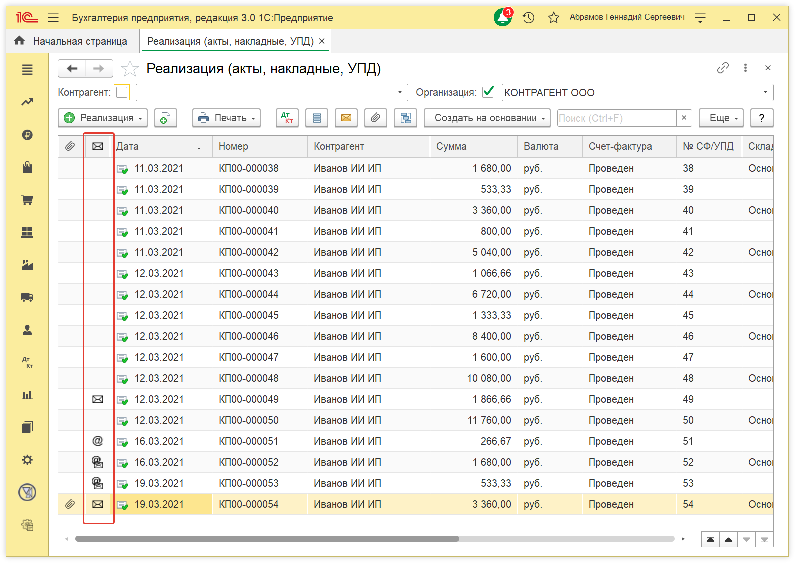

# PEN006_BUH_POST
Отправлено почтой (Пометка документов, которые отправлены почтой или по e-mail)

Расширение помогает упомнить какие документы вы отправляли клиентам по почте а какие по e-mail.

Это работает в БУХ 30 для документов `РТУ` и `Счет покупателю`  
Документ считается отправленным по почте если был распечатан Конверт.  
Документ считается отправленным по e-mail если на форме `Отправка сообщения` была нажата кнопка `Отправить`.  

В отправленных документах заполняются дополнительные сведения:
* Дата печати конверта
* Дата отправки e-mail

Внешний вид модифицированного списка документов:

